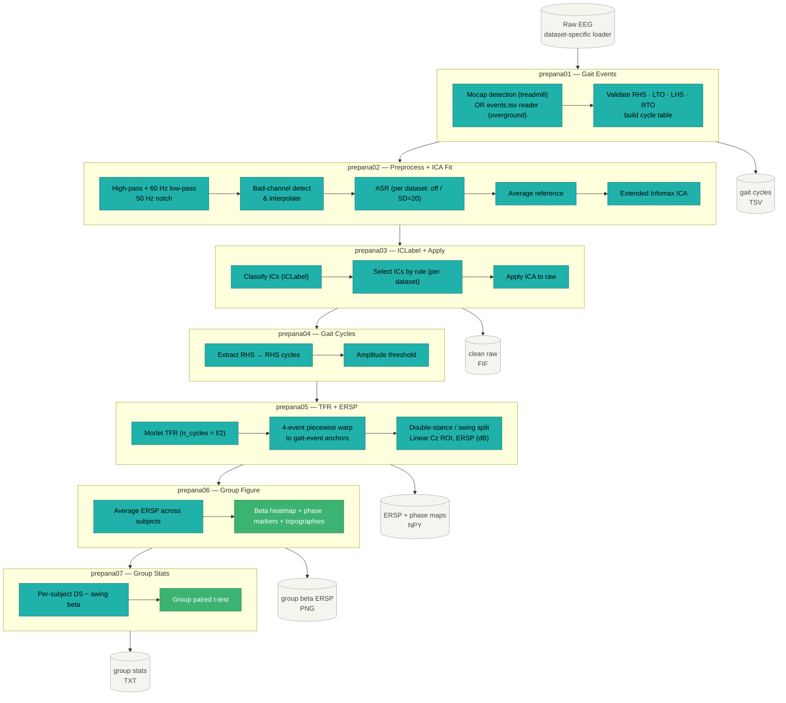
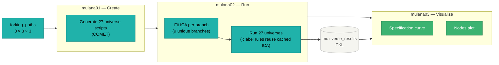
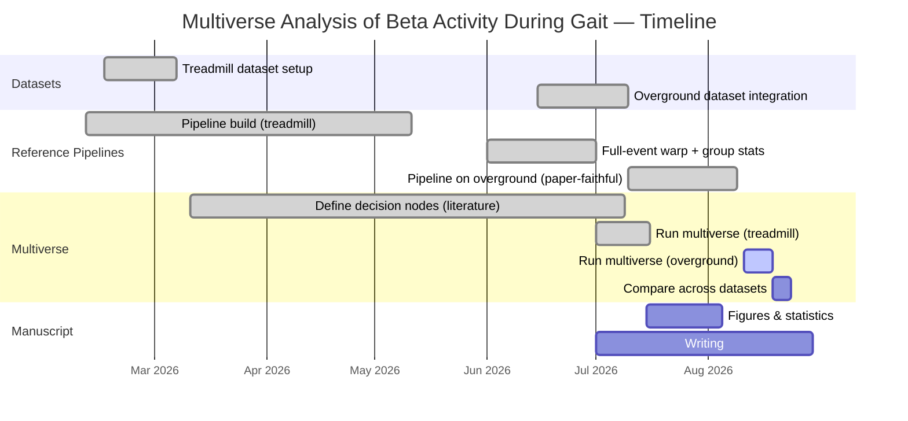

# Multiverse Analysis of Beta Activity During Gait

A modular EEG analysis pipeline investigating **beta-band cortical activity (~13–30 Hz)** across the gait cycle, focused on **double-stance vs swing** phase dynamics. The project uses a **multiverse analysis** framework to quantify how preprocessing decisions affect neural results, and tests robustness across **two independent datasets** — the **stepup / treadmill walking dataset** and the **jacobsen / overground walking dataset** — from two different labs.

> The repository is under active development; scripts and parameters may evolve as the methodology is refined.

---

## Scientific Background

Cortical beta oscillations are implicated in motor control and gait. Sensorimotor beta power increases (event-related synchronisation, ERS) around double-support phases and decreases (event-related desynchronisation, ERD) during swing. These estimates are sensitive to EEG preprocessing choices.

Rather than committing to a single pipeline, this project runs many plausible pipelines and asks: **which results are robust, and which depend on methodological choices?** The approach follows the multiverse framework of Steegen et al. (2016), adapted for EEG by Clayson et al. (2021).

This project investigates:
- How beta dynamics differ between **double-stance and swing** phases
- How preprocessing decisions influence estimates of beta activity
- The robustness of neural findings across preprocessing pipelines **and across two datasets**

---

## Two Datasets, Two Reference Pipelines

A central design choice: the two datasets are analysed with **different, dataset-appropriate reference pipelines**, while the **same 27-universe multiverse** is applied to both. This is deliberate. There is no single correct preprocessing pipeline, and pipelines legitimately vary between labs and recording conditions; robustness is therefore established not by forcing one pipeline onto both datasets, but by showing the effect holds across the **same systematic preprocessing multiverse** in each.

- The **stepup / treadmill walking dataset** uses a reference pipeline built from the authors' own defensible choices.
- The **jacobsen / overground walking dataset** uses a reference pipeline that **reproduces the preprocessing of the original source study** (Jacobsen et al. 2020), with three documented deviations (below).

Dataset-specific differences (loader, montage, event source, baseline, and reference-pipeline parameters) are isolated in per-dataset config files; the multiverse machinery is shared.

### stepup / treadmill walking dataset (`datasets/stepup/`)
Mobile EEG during split-belt treadmill walking. BrainVision format, BIDS. Two recordings per subject: `task-STAND` (standing baseline) and `task-CS` (constant-speed walking). Gait events from motion capture (RHS / LHS / RTO / LTO). 17 subjects in the reference-pipeline analysis (one subject excluded — see below).

**Reference pipeline (treadmill):** ASR **off**, standing-baseline normalisation, 60 Hz low-pass, 50 Hz notch, average reference, Extended Infomax ICA, balanced ICLabel rule, computed group-median gait-event anchors. One subject (S21) is excluded because it fails AutoReject under the ASR-off setting (only 12/243 clean epochs) — a live pipeline exclusion, not a fixed list.

### jacobsen / overground walking dataset (`datasets/jacobsen/`, OpenNeuro ds003039)
Mobile EEG during outdoor free walking. EEGLAB `.set/.fdt`, 500 Hz (downsampled to 250 Hz in the reference pipeline), 64-channel extended 10-05. Analysis uses the **steady-state even-terrain walking segment without button presses** (`start_easy` → `end_easy`, confirmed as even-terrain single-task walking from the dataset's BIDS event metadata). Gait events are read pre-computed from `events.tsv` (foot-accelerometer detection). 18 usable subjects (sub-019 excluded — corrupt at source).

**Reference pipeline (overground) — reproduces Jacobsen et al. 2020** with these parameters: 250 Hz downsample, 0.2–60 Hz band-pass, ASR cutoff 20, full-rank average reference, standing baseline from `start_standing` → `end_standing` (used for both ASR calibration and ERSP normalisation), ICLabel artifact-rejection rule (reject P(eye) > 0.9 or P(muscle) > 0.9), and fixed warp latencies `[1, 18, 50, 68, 100]`.

**Three documented deviations from the source study:**
1. **Extended Infomax ICA** in place of the paper's AMICA.
2. **50 Hz notch filter** in place of the paper's Zapline-plus.
3. **ASR SD=20 with burst correction** in place of the paper's channel-rejection-only ASR call (this deviation arose from tooling constraints, not a methodological preference).

**Documented dataset caveats:**
- **Duplicate recordings (source-side).** Content hashing (SHA-256) and OpenNeuro S3 ETag cross-validation confirm three duplicate groups in ds003039 as distributed: sub-005 ≡ sub-007 and sub-009 ≡ sub-013 (byte-identical EEG *and* events), and sub-006 / sub-008 (identical EEG signal, different `events.tsv`). The effective number of independent recordings is therefore ≤16. Group statistics are reported both for the full N=18 and for a deduplicated primary cohort (dropping 007, 013, and both 006/008).
- **Turns** within the outdoor route cannot be detected or excluded from the analysis segment (accepted limitation).

---

## Repository Structure

```
betaGaitMultiverse/
│
├── scripts/
│   ├── main_script_eegpipeline.py       # Runs the 7 reference pipeline stages in sequence
│   ├── prepana01_prep_gaitevents.py     # Stage 1: gait events (mocap OR events.tsv)
│   ├── prepana02_raw2ica.py             # Stage 2: preprocessing + ICA fit
│   ├── prepana03_ica2clean.py           # Stage 3: ICLabel + ICA application
│   ├── prepana04_clean2gaitcycles.py    # Stage 4: gait cycle extraction
│   ├── prepana05_gaitcycles2tfr.py      # Stage 5: TFR + ERSP + 4-event warp
│   ├── prepana06_plotbetagait.py        # Stage 6: group beta ERSP figure
│   ├── prepana07_betaphase_stats.py     # Stage 7: group paired t-test (DS vs swing)
│   ├── mulana01_create_multiverse.py    # Multiverse: create 27 universe scripts (COMET)
│   ├── mulana02_run_multiverse.py       # Multiverse: run universes
│   ├── mulana03_visualize_multiverse.py # Multiverse: specification curve + plots
│   ├── mulana04_zoom_universes.py       # Multiverse: lowest/median/highest universe comparison
│   ├── freeze_gait_anchors.py           # Compute + freeze group-median gait-event anchors
│   └── setup/
│       └── 00_download_openneuro_dataset.py  # Download raw data (openneuro-py; Jacobsen-specific)
│
├── src/
│   ├── config.py                        # Centralised parameters + ACTIVE_DATASET selector
│   ├── config_stepup.py                 # treadmill settings (BrainVision, mocap, STAND, ASR off)
│   ├── config_jacobsen.py               # overground settings (EEGLAB, events.tsv, paper-faithful)
│   ├── paths.py                         # Dataset directory resolver (generic)
│   ├── pipeline_steps.py                # load (format-dispatch), preprocess, ICA
│   ├── ersp.py                          # Shared: anchors, 4-event warp, phase split, beta ROI
│   ├── multiverse_pipeline.py           # Single-subject multiverse branch runner
│   ├── preprocessing.py                 # Channel dropping, bad-channel detection
│   ├── ica_utils.py                     # ICA fit, ICLabel probabilities, IC selection rules
│   ├── gait_cycles.py                   # Gait event detection + cycle extraction/validation
│   ├── spatial_filter.py                # Linear distance-weighted ROI (centred on Cz)
│   ├── resume.py                        # Per-subject/per-stage resumability
│   ├── qc.py                            # QC logging utilities
│   └── nodes/
│       ├── asr_node.py                  # Artifact Subspace Reconstruction (ASR)
│       └── gedai_node.py                # GEDAI (evaluated; excluded from multiverse — see below)
│
├── logs/                                # Run logs (git-ignored)
│
└── results/
    ├── pipeline/<dataset>/{plots,qc}/                   # Per-dataset reference pipeline outputs
    └── multiverse/<dataset>/{branches,comet,outputs}/  # Per-dataset multiverse (nested)
```

---

## Reference Pipeline (7 stages)

The workflow progresses from raw EEG to a group-level statistical test of the beta double-stance-vs-swing contrast. Each stage is a separate script; `main_script_eegpipeline.py` runs all seven in sequence. The per-dataset parameters differ (see above); the stage *structure* is shared.



**Gait phases (event-anchored).** Cycles are time-warped on all four events (RHS → LTO → LHS → RTO → RHS) to fixed anchors, so a given percentage of the cycle means the same gait phase in every stride:
- **Double support:** RHS → LTO (initial) and LHS → RTO (terminal)
- **Swing:** LTO → LHS and RTO → RHS

The treadmill reference pipeline uses **computed group-median anchors** (frozen to a versioned calibration file so they are stable across runs). The overground reference pipeline uses the source study's **fixed warp latencies** `[1, 18, 50, 68, 100]`.

**Normalisation.** Both datasets use **standing-baseline** normalisation as primary (dB relative to a standing reference). The double-stance − swing contrast is invariant to the baseline choice (a per-subject constant that cancels in the paired difference).

**Key parameters** (centralised in `src/config.py`, dataset-specific values in `src/config_*.py`):
- Low-pass 60 Hz, notch 50 Hz, average reference
- ICA: Extended Infomax
- TFR: Morlet wavelets 8–60 Hz, `n_cycles = f/2`, 5% edge crop, 101-point cycle normalisation
- Spatial filter: **linear** distance-weighted ROI centred on Cz

**To run:** set `ACTIVE_DATASET` (`stepup` or `jacobsen`) in `src/config.py`, then run `main_script_eegpipeline.py`.

---

## Multiverse Analysis

The multiverse systematically varies **three preprocessing decisions across 27 universes (3 × 3 × 3)**. The **same multiverse grid and machinery are applied to both datasets** — this is the mechanism by which cross-dataset robustness is established.

| Decision | Options | Rationale |
|----------|---------|-----------|
| `highpass_hz` | 0.5, 1.0, 2.0 Hz | Klug & Gramann 2021; Delorme 2023 |
| `asr_mode` | off, sd3 (aggressive), sd20 (lenient) | Chang et al. 2020; Mullen et al. 2015 |
| `iclabel_rule` | conservative — keep P(brain) > 0.9; balanced — keep P(brain) > 0.7; liberal — reject only P(muscle/eye) > 0.9 | Pion-Tonachini et al. 2019 |

Fixed across all universes: `lowpass_hz = 60.0`, TFR 8–60 Hz, average reference, Extended Infomax ICA, computed group-median anchors, and the event-anchored warp + double-stance/swing contrast (identical to the shared machinery via `src/ersp.py`).

> **Note on reference-vs-multiverse.** Each dataset's *reference* pipeline may sit inside or outside the multiverse grid. The treadmill reference (ASR off, HP 1 Hz, balanced ICLabel) corresponds to one grid vertex. The overground reference is intentionally **off-grid** (0.2 Hz high-pass and the paper's artifact-rejection ICLabel rule are not multiverse levels), because it is defined by source-study fidelity rather than by the grid.

**Outcome:** per-subject double-stance − swing beta contrast (dB, Cz-ROI), and the group-level paired t-statistic across subjects.



**Status.** The multiverse has been run and completed for the **stepup / treadmill walking dataset** (all 27 universes, 60 Hz). The multiverse for the **jacobsen / overground walking dataset** is **in progress** (ICA pre-warm phase currently running); `results/multiverse/jacobsen/` will be populated on completion.

**ICA caching.** ICA is cached per branch, keyed on `{highpass_hz, asr_mode, lowpass_hz}` only — the three `iclabel_rule` values reuse each cached decomposition. This yields **9 unique ICA branches** across the 27 universes.

**GEDAI (excluded).** GEDAI was evaluated as a candidate node but failed a quantitative QC gate: on these data it removed **~96% of sensorimotor beta power**. It is therefore excluded from the multiverse and retained only as a documented methods-validation finding (`src/nodes/gedai_node.py`, `scripts/diag_gedai_check.py`).

**To run:** `mulana01_create_multiverse.py` → `mulana02_run_multiverse.py` → `mulana03_visualize_multiverse.py`.

**Runtime.** The 9 ICA branches × subjects dominate cost. The treadmill multiverse (27 universes) completed in roughly 16 h; the overground multiverse is longer per unit because of the longer recordings. Runs use per-subject/per-branch process isolation and resumability, so an interrupted run resumes from its cache rather than recomputing completed units.

---

## Environment Setup

This project uses [uv](https://github.com/astral-sh/uv) for environment management.

```bash
# Install uv
pip install uv

# Create and activate environment
uv venv
.venv\Scripts\activate        # Windows
source .venv/bin/activate     # macOS/Linux

# Install dependencies
uv pip install -e .
```

Key dependencies: `mne`, `mne-icalabel`, `autoreject`, `comet-toolbox`, `asrpy` / `meegkit`, `numpy`, `pandas`, `matplotlib`, `scipy`.

---

## Timeline



---

## References

- Steegen S, Tuerlinckx F, Gelman A, Vanpaemel W (2016). Increasing transparency through a multiverse analysis. *Perspectives on Psychological Science*, 11(5), 702–712.
- Clayson PE, Carbine KA, Baldwin SA, Larson MJ (2021). Methodological reporting behavior, sample sizes, and statistical power in studies of event-related potentials. *Psychophysiology*, 58(2), e13437.
- Klug M, Gramann K (2021). Identifying key factors for improving ICA-based decomposition of EEG data in mobile and stationary experiments. *European Journal of Neuroscience*, 54(12), 8406–8420.
- Delorme A (2023). EEG is better left alone. *Scientific Reports*, 13, 2372.
- Chang C-Y, Hsu S-H, Pion-Tonachini L, Jung T-P (2020). Evaluation of Artifact Subspace Reconstruction for automatic artifact components removal in multi-channel EEG recordings. *IEEE Transactions on Biomedical Engineering*, 67(4), 1114–1121.
- Mullen TR, et al. (2015). Real-time neuroimaging and cognitive monitoring using wearable dry EEG. *IEEE Transactions on Biomedical Engineering*, 62(11), 2553–2567.
- Pion-Tonachini L, Kreutz-Delgado K, Makeig S (2019). ICLabel: An automated electroencephalographic independent component classifier, dataset, and feature benchmark. *NeuroImage*, 198, 181–197.
- Grandchamp R, Delorme A (2011). Single-trial normalization for event-related spectral decomposition reduces sensitivity to noisy trials. *Frontiers in Psychology*, 2, 236.
- Gwin JT, Gramann K, Makeig S, Ferris DP (2011). Electrocortical activity is coupled to gait cycle phase during treadmill walking. *NeuroImage*, 54(2), 1289–1296.
- Jacobsen NSJ, Blum S, Witt K, Debener S (2020). A walk in the park? Characterizing gait-related artifacts in mobile EEG recordings. *European Journal of Neuroscience*.
```