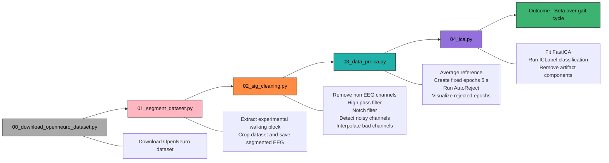
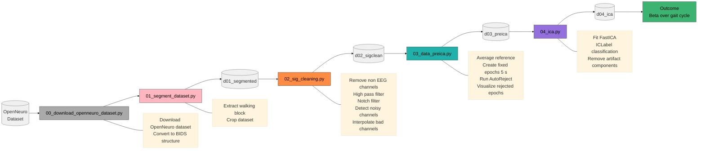
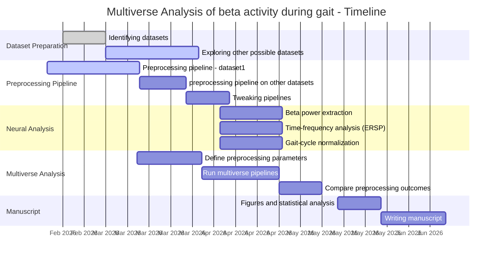

# Multiverse Analysis of Beta Activity During Gait

This repository implements a modular EEG analysis pipeline for studying cortical dynamics during **split-belt treadmill walking**.
The primary scientific focus is **beta-band activity (≈13–30 Hz) across the gait cycle**, particularly the transition between **stance and swing phases**.

The project explores how methodological decisions in EEG preprocessing influence neural results through a **multiverse analysis** approach. Instead of committing to a single preprocessing pipeline, multiple plausible pipelines are evaluated to determine how analysis choices affect conclusions.

The repository is currently under active development. Scripts and parameters may evolve as the methodological framework is refined.

---
## Overview

This repository implements a full analysis workflow from raw EEG to gait-locked neural activity:
    - Preprocessing (filtering, rereferencing, artifact handling)= - Event detection and epoching around gait events
    - Automated artifact rejection
    - Independent Component Analysis (ICA)
    - Time-domain and time–frequency analyses
    - Exploration of alternative preprocessing strategies using a Multiverse analysis

The emphasis is on transparency, reproducibility, and a quantitative evaluation of how preprocessing decisions affect neural measures.

---

## Scientific Goal

Walking is not purely spinal or mechanical — cortical oscillations, especially in the **beta band**, are thought to contribute to motor control and gait adaptation.

This project investigates:

* How beta dynamics differ between **stance and swing phases**
* How preprocessing decisions influence estimates of beta activity
* The robustness of neural findings across multiple preprocessing pipelines

The broader aim is to improve **reproducibility and methodological transparency** in mobile EEG research.

---

## Data Structure

The pipeline uses mobile EEG data stored in **BIDS format**.

Example structure:

```
data/d00_raw

└── sub-S18
    └── eeg
        ├── sub-S18_task-task_eeg.set
        ├── sub-S18_task-task_events.tsv
        └── sub-S18_task-task_channels.tsv
```

Event markers include gait-related events such as:

* RHS — Right heel strike
* LHS — Left heel strike
* RTO — Right toe off
* LTO — Left toe off

Additional experiment markers define task blocks (e.g., B1, B2, etc.).

---

## Analysis Pipeline

The workflow progresses through several stages. Each stage is implemented as a separate script.

```
Raw BIDS EEG
      ↓
Segmentation
      ↓
Signal Cleaning
      ↓
Pre-ICA Preparation
      ↓
Independent Component Analysis (ICA)
      ↓
Clean EEG Data
      ↓
Time-frequency and gait-cycle analyses
```

---






## Downloading dataset

Script:

```
scripts/00_download_openneuro_dataset.py
```

Purpose:

Download dataset of interest from OpenNeuro with dataset ID.

Output:

```
data/d00_raw

└── sub-S18
    └── eeg
        ├── sub-S18_task-task_eeg.set
        ├── sub-S18_task-task_events.tsv
        └── sub-S18_task-task_channels.tsv
```

---

## 1. Segmentation

Script:

```
scripts/01_segment_dataset.py
```

Functions:

```
src/segmentation.py
src/events.py
```

Purpose:

Extract the relevant experimental block from the full recording.

Steps:

1. Load BIDS EEG dataset
2. Load event markers from `events.tsv`
3. Identify task segment boundaries
4. Crop raw EEG data to the target interval
5. Save segmented dataset

Output:

```
data/d01_segmented/sub-XX_preadapt_raw.fif
```

---

## 2. Signal Cleaning

Script:

```
scripts/02_sig_cleaning.py
```

Functions:

```
src/preprocessing.py
```

Purpose:

Perform initial EEG preprocessing before ICA.

Steps:

* Load segmented data
* Remove non-EEG channels
* Apply high-pass filtering
* Apply notch filtering
* Detect noisy channels using robust statistics
* Interpolate bad channels
* Save cleaned raw dataset

Output:

```
data/d02_sigclean/sub-XX_clean_raw.fif
```

---

## 3. Pre-ICA Data Preparation

Script:

```
scripts/03_data_preica.py
```

Functions:

```
src/preprocessing.py
```

Purpose:

Prepare data for Independent Component Analysis.

Steps:

1. Interpolate bad channels
2. Re-reference EEG to common average
3. Create fixed-length epochs (5 s)
4. Run **AutoReject** for automated artifact rejection
5. Visualize rejected epochs
6. Save cleaned epochs for ICA

Output:

```
data/d03_preica/sub-XX_preica_epo_raw.fif
```

---

## 4. Independent Component Analysis

Script:

```
scripts/04_ica.py
```

Functions:

```
src/ica_utils.py
```

Purpose:

Remove physiological artifacts from EEG.

Steps:

1. Load pre-ICA data
2. Fit **FastICA** decomposition
3. Classify components using **ICLabel**
4. Identify non-brain components
5. Remove artifact components
6. Apply ICA cleaning to raw data
7. Save cleaned EEG data and ICA solution

Outputs:

```
data/d04_ica/sub-XX_desc-clean_raw.fif
data/d04_ica/sub-XX_ica.fif
```

Visualizations include:

* ICA component maps
* Artifact component inspection
* Removed components summary

---

## Multiverse Analysis

Traditional EEG pipelines rely on a **single preprocessing path**.
However, small decisions can meaningfully influence neural results.

Examples of variable parameters:

* High-pass filter cutoff
* Artifact rejection thresholds
* Referencing strategy
* Epoching strategy
* ICA rejection criteria

The **multiverse analysis framework** systematically explores combinations of these parameters to evaluate how preprocessing decisions affect:

* Beta power estimates
* Time-frequency dynamics
* Gait-phase neural modulation

This approach helps identify **robust neural effects** that remain stable across analysis choices.

---


## Environment Setup

This project uses **uv** for Python environment management and dependency installation.

uv is a fast Python package manager that replaces traditional workflows using `venv` and `pip`.

### 1. Install uv

Install uv using pip:

```bash
pip install uv
```

or via the official installer:

```bash
curl -Ls https://astral.sh/uv/install.sh | sh
```

Verify installation:

```bash
uv --version
```

---

### 2. Create the virtual environment

From the repository root:

```bash
uv venv
```

This creates a `.venv` folder inside the project.

---

### 3. Activate the environment

Linux / macOS:

```bash
source .venv/bin/activate
```

Windows:

```bash
.venv\Scripts\activate
```

---

### 4. Install dependencies

Install the required packages:

```bash
uv pip install numpy pandas matplotlib mne mne-bids autoreject mne-icalabel
```

Because uv resolves dependencies quickly, installation should take only a few seconds.

---

### 5. Verify installation

Run Python and test that MNE loads correctly:

```bash
python
>>> import mne
>>> print(mne.__version__)
```

If no errors appear, the environment is ready.

---

## Key Dependencies

Core packages:

* **MNE-Python** – EEG processing
* **MNE-BIDS** – BIDS dataset handling
* **AutoReject** – automated artifact rejection
* **MNE-ICALabel** – ICA component classification
* **NumPy / Pandas** – data handling
* **Matplotlib** – visualization

---


