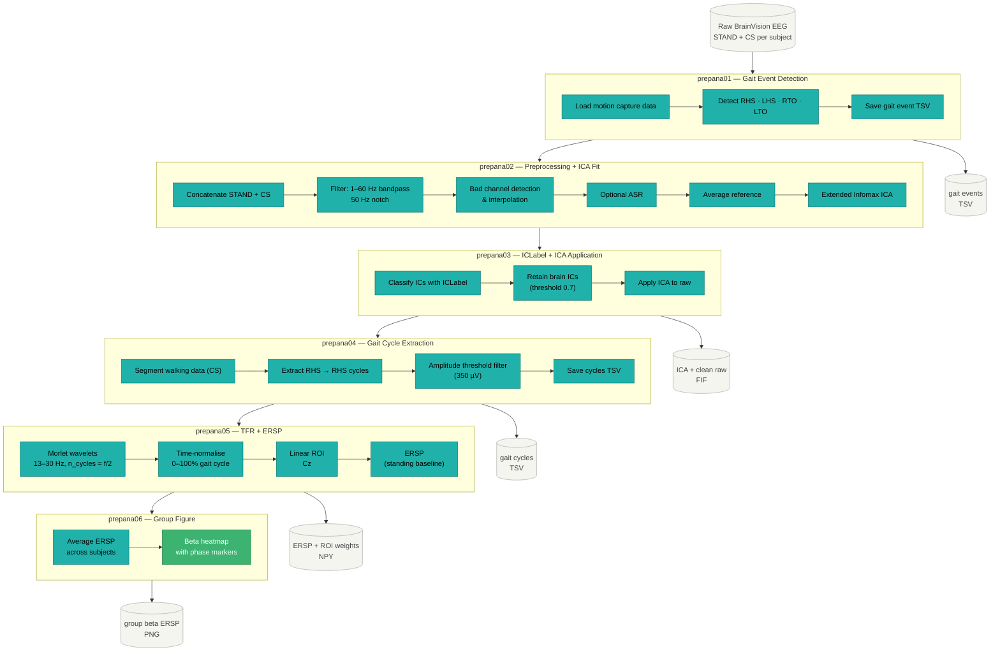
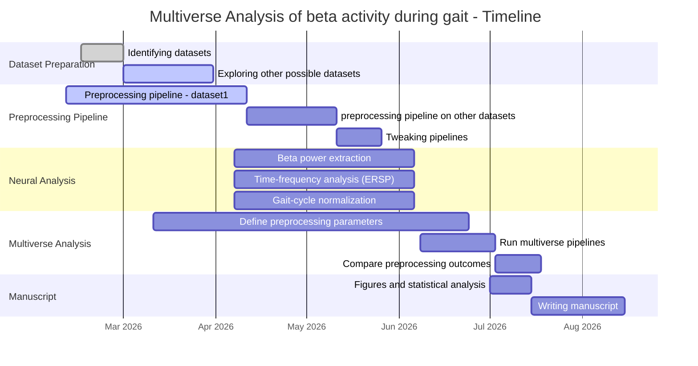

# Multiverse Analysis of Beta Activity During Gait

A modular EEG analysis pipeline investigating **beta-band cortical activity (~13–30 Hz)** across the gait cycle, with a focus on stance–swing phase dynamics. The project uses a **multiverse analysis** framework to quantify how preprocessing decisions affect neural results.

The repository is currently under active development. Scripts and parameters may evolve as the methodological framework is refined.

---

## Scientific Background

Cortical beta oscillations are implicated in motor control and gait adaptation. Beta power typically decreases (event-related desynchronisation, ERD) during movement and rebounds (event-related synchronisation, ERS) around heel strike. However, estimates of these dynamics are sensitive to EEG preprocessing choices.

Rather than committing to a single pipeline, this project runs multiple parallel pipelines, each a plausible combination of preprocessing parameters. The multiver analysis of piplelines aim to ask, *which results are robust, and which depend on methodological choices?*

This project investigates:

* How beta dynamics differ between **stance and swing phases**
* How preprocessing decisions influence estimates of beta activity
* The robustness of neural findings across multiple preprocessing pipelines

This approach follows the multiverse analysis framework introduced by Steegen et al. (2016, *Perspectives on Psychological Science*) and adapted for EEG by Clayson et al. (2021, *Psychophysiology*).

---

## Overview

This repository implements a full analysis workflow from raw EEG to gait-locked neural activity:
    - Preprocessing (filtering, rereferencing, artifact handling)= - Event detection and epoching around gait events
    - Automated artifact rejection
    - Independent Component Analysis (ICA)
    - Time-domain and time–frequency analyses
    - Exploration of alternative preprocessing strategies using a Multiverse analysis

The emphasis is on transparency, reproducibility, and a quantitative evaluation of how preprocessing decisions affect neural measures.

---

## Dataset

Mobile EEG recorded during split-belt treadmill walking. 18 subjects. BrainVision format, stored in BIDS structure.

Each subject has two recordings:
- `task-STAND` — standing baseline
- `task-CS` — treadmill walking (constant speed)

Motion capture provides gait events: right/left heel strike (RHS/LHS) and toe-off (RTO/LTO).

---

## Repository Structure

```
betaGaitMultiverse/
│
├── scripts/                               # Executable scripts
│   ├── main_script_eegpipeline.py         # Runs all 6 canonical pipeline stages
│   ├── prepana01_prep_gaitevents.py       # Stage 1: gait event detection
│   ├── prepana02_raw2ica.py               # Stage 2: preprocessing + ICA fitting
│   ├── prepana03_ica2clean.py             # Stage 3: ICLabel + ICA application
│   ├── prepana04_clean2gaitcycles.py      # Stage 4: gait cycle extraction
│   ├── prepana05_gaitcycles2tfr.py        # Stage 5: TFR + ERSP computation
│   ├── prepana06_plotbetagait.py          # Stage 6: group beta ERSP figure
│   ├── mulana01_run_multiverse.py         # Multiverse entry point (COMET)
│   └── 00_download_openneuro_dataset.py   # Download raw data from OpenNeuro
│
├── src/                                   # Shared library modules
│   ├── config.py                          # Paths, subject list, pipeline constants
│   ├── paths.py                           # Dataset directory resolver
│   ├── pipeline_steps.py                  # Core steps: load, preprocess, ICA
│   ├── multiverse_pipeline.py             # Single-subject multiverse branch runner
│   ├── preprocessing.py                   # Channel dropping, bad channel detection
│   ├── ica_utils.py                       # ICA fitting and ICLabel classification
│   ├── gait_cycles.py                     # Gait event detection and cycle extraction
│   ├── spatial_filter.py                  # Gaussian ROI weights (centred on Cz)
│   ├── qc.py                              # QC logging utilities
│   └── nodes/
│       └── asr_node.py                    # Artifact Subspace Reconstruction (ASR)
│
└── results/
    ├── pipeline/
    │   ├── plots/                         # Group beta ERSP figures
    │   └── qc/                            # QC flags and summary tables
    └── multiverse/
        ├── outputs/                       # Specification curve, multiverse plot
        ├── branches/                      # Cached ICA per branch (gitignored)
        └── comet/                         # COMET internal files (gitignored)
```
---

## EEG Analysis Pipeline

The workflow progresses through several stages. Each stage is implemented as a separate script.
```
Raw BrainVision EEG (STAND + CS recordings)
      ↓
prepana01: Gait Event Detection
          (motion capture → RHS, LHS, RTO, LTO timestamps)
      ↓
prepana02: Preprocessing + ICA Fit
          (filter 1–60 Hz, notch 50 Hz, bad channels,
           optional ASR, average reference, Extended Infomax ICA)
      ↓
prepana03: ICLabel + ICA Application
          (classify components, retain brain ICs, apply to raw)
      ↓
Clean Continuous EEG
      ↓
prepana04: Gait Cycle Extraction
          (RHS → RHS, amplitude threshold, save cycle TSV)
      ↓
prepana05: TFR + ERSP
          (Morlet wavelets 13–30 Hz, time-normalise to 0–100%,
           Gaussian ROI Cz σ=40 mm, standing baseline)
      ↓
prepana06: Group Beta ERSP Figure
          (average across subjects, heatmap with gait phase markers)
```



**To run the full pipeline:**

```python
# Run main_script_eegpipeline.py in the interactive window
# All 6 stages execute in sequence; results saved to results/pipeline/
```

Key parameters (set in `src/config.py`):
- Filter: 1–60 Hz bandpass, 50 Hz notch
- ICA: Extended Infomax, ICLabel brain threshold = 0.7
- TFR: Morlet wavelets, n_cycles = freq/2, edge crop 5%
- Spatial filter: Gaussian ROI centred on Cz, σ = 40 mm (Seeber et al. 2015)

---

## Multiverse Analysis

The multiverse analysis systematically varies four preprocessing decisions across 16 universes (2 × 2 × 2 × 2):

| Decision | Options | Rationale |
|----------|---------|-----------|
| `use_asr` | False, True | Mullen et al. 2015; Gorjan et al. 2022 |
| `brain_thresh` | 0.7, 0.9 | Pion-Tonachini et al. 2019 |
| `baseline_type` | standing, walking_mean | Makeig et al. 1993; Seeber et al. 2015 |
| `phase_window` | full, peak | Petersen et al. 2012; Bulea et al. 2015 |

Fixed across all universes: `highpass_hz = 1.0`, `lowpass_hz = 60.0`.

The primary outcome is a group-level paired t-statistic comparing stance vs swing beta power across gait cycles, aggregated over 16 subjects.

**To run the multiverse:**

```python
# Run mulana01_run_multiverse.py in the interactive window
# Generates 16 universe scripts via COMET, runs them sequentially,
# and produces a specification curve in results/multiverse/outputs/
```

ICA is cached per branch in `results/multiverse/branches/` so that universes sharing the same filter + ICA settings reuse cached decompositions. There are 4 unique ICA branches across the 16 universes.

**Runtime estimate:**
- First run of each ICA branch: ~90 min (16 subjects × ~5 min ICA)
- Subsequent universes reusing cached ICA: ~20–30 min each
- Total: ~6–8 hours

---

## Environment Setup

This project uses [uv](https://github.com/astral-sh/uv) for environment management.

```bash
# Install uv
pip install uv

# Create and activate environment
uv venv
.venv\Scripts\activate        # Windows
source .venv/bin/activate     # macOS/Linux

# Install dependencies
uv pip install -e .
```

Key dependencies: `mne`, `mne-icalabel`, `autoreject`, `comet-toolbox`, `numpy`, `pandas`, `matplotlib`, `scipy`.

---
## Timeline



---

## References

- Steegen S, Tuerlinckx F, Gelman A, Vanpaemel W (2016). Increasing transparency through a multiverse analysis. *Perspectives on Psychological Science*, 11(5), 702–712.
- Clayson PE, Carbine KA, Baldwin SA, Larson MJ (2021). Methodological reporting behavior, sample sizes, and statistical power in studies of event-related potentials. *Psychophysiology*, 58(2), e13437.
- Pion-Tonachini L, Kreutz-Delgado K, Makeig S (2019). ICLabel: An automated electroencephalographic independent component classifier, dataset, and feature benchmark. *NeuroImage*, 198, 181–197.
- Seeber M, Scherer R, Wagner J, Solis-Escalante T, Müller-Putz GR (2015). EEG beta suppression and low gamma modulation are different elements of human upright walking. *Frontiers in Human Neuroscience*, 9, 1–9.
- Petersen TH, Willerslev-Olsen M, Conway BA, Nielsen JB (2012). The motor cortex drives the muscles during walking in human subjects. *Journal of Physiology*, 590(10), 2443–2452.
- Bulea TC, Kim J, Damiano DL, Stanley CJ, Park HS (2015). Prefrontal, posterior parietal and sensorimotor network activity underlying speed control during walking. *Frontiers in Human Neuroscience*, 9, 247.
- Mullen TR et al. (2015). Real-time neuroimaging and cognitive monitoring using wearable dry EEG. *IEEE Transactions on Biomedical Engineering*, 62(11), 2553–2567.
- Gorjan D, Gramann K, De Pauw K, Marusic U (2022). Removal of movement-induced EEG artifacts: current state of the art and guidelines. *Journal of Neural Engineering*, 19(1), 011004.
---
